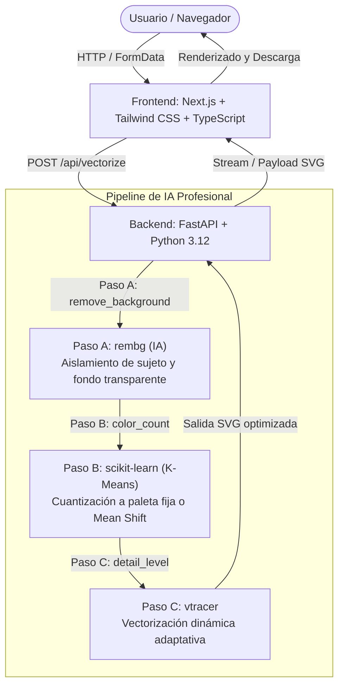

# ⚡ TraceAI

> **Vectorización inteligente de imágenes a SVG impulsada por IA y algoritmos avanzados.**

[](https://fastapi.tiangolo.com)
[](https://nextjs.org/)
[](https://tailwindcss.com/)
[](https://www.python.org/)
[](https://www.typescriptlang.org/)

---

## 📌 Descripción del Proyecto

**TraceAI** es una plataforma SaaS diseñada para convertir imágenes rasterizadas (mapas de bits como PNG, JPG, WEBP) en vectores SVG limpios, escalables y optimizados para producción. Combinando la velocidad del motor de vectorización de alto rendimiento (`vtracer`) con una interfaz moderna y reactiva, TraceAI permite a diseñadores, desarrolladores y creadores vectorizar recursos gráficos en cuestión de segundos.

---

## 🏗️ Arquitectura del Sistema

El proyecto está diseñado bajo una arquitectura modular desacoplada:



### Stack Tecnológico

| Capa | Tecnologías | Propósito |
| :--- | :--- | :--- |
| **Backend** | [FastAPI](https://fastapi.tiangolo.com/), [Uvicorn](https://www.uvicorn.org/), Python 3.12, [rembg](https://github.com/danielgatis/rembg), [scikit-learn](https://scikit-learn.org/), [OpenCV](https://opencv.org/), [Pillow](https://python-pillow.org/), [vtracer](https://github.com/visioncortex/vtracer) | Pipeline de IA profesional: eliminación de fondos, cuantización K-Means, filtrado de contornos y vectorización adaptativa. |
| **Frontend** | [Next.js](https://nextjs.org/) (App Router), [React](https://react.dev/), [TypeScript](https://www.typescriptlang.org/), [Tailwind CSS](https://tailwindcss.com/), [Lucide React](https://lucide.dev/), [react-compare-slider](https://github.com/nerdyman/react-compare-slider) | Layout tipo Studio con barra de herramientas de IA, Drag & Drop interactivo, comparador visual deslizante en tiempo real, controles de zoom y exportación SVG. |

---

## 📁 Estructura del Monorepo

```text
TraceAI/
├── .gitignore               # Configuración global de exclusiones Git
├── README.md                # Documentación principal del proyecto
├── backend/                 # Servicio API en FastAPI
│   ├── .gitignore           # Exclusiones específicas de Python y venv
│   ├── main.py              # Punto de entrada de la API y configuración CORS
│   ├── requirements.txt     # Dependencias de Python
│   └── venv/                # Entorno virtual de Python
└── frontend/                # Aplicación Web en Next.js
    ├── app/                 # Rutas y páginas (Next.js App Router)
    │   ├── globals.css      # Estilos globales y Tailwind CSS
    │   ├── layout.tsx       # Layout raíz
    │   └── page.tsx         # Landing Page de TraceAI
    ├── package.json         # Dependencias y scripts de Node.js
    ├── tailwind.config.ts   # Configuración de Tailwind CSS
    └── tsconfig.json        # Configuración de TypeScript
```

---

## 🚀 Guía de Inicio Rápido (Desarrollo Local)

### Prerrequisitos

Asegúrate de tener instalados los siguientes componentes en tu entorno:
- **Python:** 3.10 o superior (recomendado 3.12+)
- **Node.js:** 18.x o superior (recomendado 20+ o 24+)
- **npm**, **pnpm** o **yarn**
- **Git**

---

### 1. Configurar y Levantar el Backend

1. Dirígete a la carpeta `backend`:
   ```bash
   cd backend
   ```

2. Crea y activa el entorno virtual de Python:
   - **Linux / macOS:**
     ```bash
     python3 -m venv venv
     source venv/bin/activate
     ```
   - **Windows:**
     ```powershell
     python -m venv venv
     venv\Scripts\activate
     ```

3. Instala las dependencias del proyecto:
   ```bash
   pip install --upgrade pip
   pip install -r requirements.txt
   ```

4. Inicia el servidor de desarrollo con Uvicorn:
   ```bash
   uvicorn main:app --reload --host 0.0.0.0 --port 8000
   ```

5. Verifica el estado del servicio:
   - Endpoint de salud: [http://localhost:8000/](http://localhost:8000/)
   - Documentación Swagger interactiva: [http://localhost:8000/docs](http://localhost:8000/docs)
   - Documentación Redoc: [http://localhost:8000/redoc](http://localhost:8000/redoc)

---

### 2. Configurar y Levantar el Frontend

1. Dirígete a la carpeta `frontend`:
   ```bash
   cd frontend
   ```

2. Instala las dependencias:
   ```bash
   npm install
   ```

3. Inicia el servidor de desarrollo:
   ```bash
   npm run dev
   ```

4. Abre tu navegador en:
   - [http://localhost:3000](http://localhost:3000)

---

### 🧪 Guía de Pruebas del Frontend (Flujo Interactivo)

Con ambos servicios en ejecución (Backend en `http://localhost:8000` y Frontend en `http://localhost:3000`), puedes validar el funcionamiento de extremo a extremo:

1. **Subida Interactiva en el Canvas (Drag & Drop o Explorador):**
   - Arrastra una imagen (`.png`, `.jpg`, `.jpeg`, `.webp` o `.bmp`) sobre el canvas central. Observa la animación con iluminación cian y elevación.
   - O haz clic sobre el área para seleccionar la imagen desde tu explorador de archivos.

2. **Configuración de Parámetros de IA en el Sidebar (Características PRO):**
   - **Super-Resolución 4x (IA):** Si la imagen tiene baja resolución (<600px), el sistema activa automáticamente este switch. Utiliza la red neuronal **Real-ESRGAN** en CPU mediante ONNX Runtime para reconstruir microdetalles y evitar bordes dentados.
   - **Eliminar Fondo (IA):** Activa el switch para aislar el sujeto mediante `rembg` con purificación de bordes (*defringing*).
   - **Paleta de Colores & Editor Interactivo:**
     - Selecciona una cantidad de colores (*2, 4, 8 o 16 colores*). El sistema extraerá automáticamente la paleta con K-Means.
     - **Editar Tono:** Haz clic sobre cualquier círculo de color para abrir el selector de tono y ajustar su valor hexadecimal.
     - **Fusionar Colores (Merge):** Marca 2 colores y pulsa **"Fusionar"** para consolidar tonos redundantes antes del trazado vectorial.
   - **Nivel de Detalle:** Elige entre *Bajo (polígonos planos)*, *Medio (curvas suaves)* o *Alto (fidelidad máxima)*.
   - Haz clic en **"Vectorizar"** para procesar la imagen con las opciones seleccionadas.

3. **Comparador Visual Deslizante (Antes y Después):**
   - Una vez recibido el vector, el canvas activa el comparador interactivo `react-compare-slider`.
   - Arrastra la barra vertical divisoria para comparar en tiempo real el mapa de bits original con el vector SVG sobre una cuadrícula de transparencia.

4. **Navegación Interactiva, Zoom y Paneo en el Canvas:**
   - **Zoom con scroll del ratón:** Gira la rueda del ratón (`wheel`) sobre el canvas para acercar o alejar suavemente enfocado en la posición del puntero. Sin tope artificial (rango de 20% hasta 3000%), ideal para inspeccionar curvas Bézier a nivel subpíxel.
   - **Arrastre de la imagen (Pan):** Haz clic y arrastra con el ratón en cualquier parte del lienzo, usa el botón central o mantén presionada la **barra espaciadora**.
   - **Restablecer vista:** Haz doble clic en el lienzo o presiona el botón de reinicio para centrar la imagen al 100%.

5. **Menú de Exportación PRO (Multi-formato):**
   - Despliega el menú de exportación en la esquina inferior derecha:
     - **Descargar SVG:** Vector estándar optimizado para diseño web y gráfico.
     - **Descargar DXF:** Formato CAD industrial (AutoCAD R2010) con capas organizadas por color para corte láser, plasma y CNC.
     - **Separar por Capas (.ZIP):** Paquete comprimido con subcarpetas `svg_layers/` y `dxf_layers/` con archivos individuales por cada color para serigrafía, vinil textil y rotulación.

6. **Reinicio y Comprobación de Errores:**
   - Pulsa **"Nueva Imagen"** en la barra superior para reiniciar estados y procesar un nuevo archivo.
   - Sube un archivo no soportado para verificar los mensajes descriptivos de error.

---

## 🔌 Endpoints de la API

| Método | Endpoint | Parámetros / Payload | Descripción | Respuesta Ejemplo |
| :--- | :--- | :--- | :--- | :--- |
| `GET` | `/` | Ninguno | Verificación de estado del servicio (Health Check). | `{"status": "TraceAI Backend API Online"}` |
| `POST` | `/api/vectorize` | `multipart/form-data`<br>• `file`: Imagen (PNG, JPG, WEBP, BMP, máx 15MB)<br>• `remove_background`: `bool` (opcional, def: `false`)<br>• `color_count`: `int` (opcional, `0`=auto, `2..64` K-Means)<br>• `detail_level`: `'low'` \| `'medium'` \| `'high'` (def: `'medium'`)<br>• `super_resolution`: `bool` (opcional, Real-ESRGAN 4x)<br>• `custom_palette`: `str` (opcional, lista Hex ej: `"#FF0000,#00FF00"`) | Pipeline profesional de IA: Super-Resolución 4x (Real-ESRGAN), remoción de fondo (`rembg`), cuantización K-Means / paleta personalizada y vectorización adaptativa (`vtracer`). | Archivo SVG descargable (`image/svg+xml`) con cabecera `Content-Disposition`. |
| `POST` | `/api/palette` | `multipart/form-data`<br>• `file`: Imagen<br>• `color_count`: `int` (2..32, def: `4`)<br>• `remove_background`: `bool` (def: `false`) | Analiza y extrae los N colores más dominantes con K-Means ordenados por frecuencia de píxeles. | `{"colors": ["#1A2B3C", "#FFFFFF", "#FF5733"]}` |
| `POST` | `/api/export/dxf` | `form-data`<br>• `svg_content`: Texto plano XML del SVG<br>• `filename`: Nombre base del archivo | Convierte las curvas SVG a entidades CAD DXF (AutoCAD R2010) con capas asignadas por color. | Archivo binario DXF (`application/dxf`). |
| `POST` | `/api/export/layers-zip` | `form-data`<br>• `svg_content`: Texto plano XML del SVG<br>• `filename`: Nombre base del archivo | Separa el diseño por cada color único y empaqueta capas independientes SVG y DXF en un archivo comprimido. | Archivo comprimido ZIP (`application/zip`). |

---

## 🛠️ Buenas Prácticas y Flujo de Trabajo

- **Variables de Entorno:** Nunca confirmes archivos `.env` al repositorio. Utiliza `.env.example` para documentar claves requeridas.
- **Formato y Calidad de Código:**
  - Backend: `black`, `flake8` o `ruff`
  - Frontend: `ESLint` y `Prettier`
- **Ramas:** Se recomienda usar el flujo `feature/nombre-de-funcionalidad` o `fix/nombre-del-bug` hacia `main`.

---

## 📄 Licencia

Este proyecto se distribuye bajo la licencia MIT.
