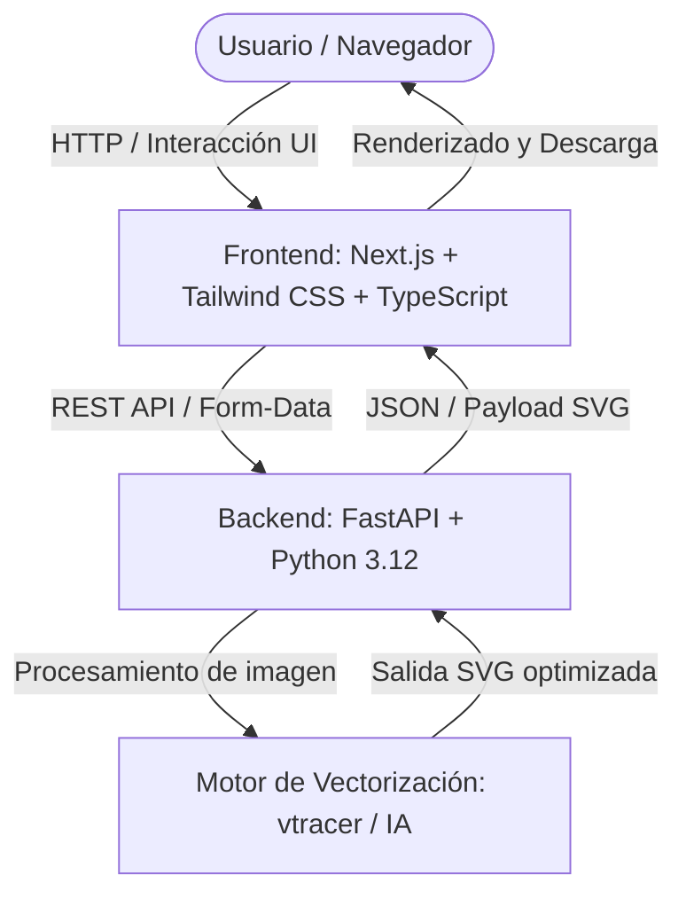

# ⚡ TraceAI

> **Vectorización inteligente de imágenes a SVG impulsada por IA y algoritmos avanzados.**

[](https://fastapi.tiangolo.com)
[](https://nextjs.org/)
[](https://tailwindcss.com/)
[](https://www.python.org/)
[](https://www.typescriptlang.org/)

---

## 📌 Descripción del Proyecto

**TraceAI** es una plataforma SaaS diseñada para convertir imágenes rasterizadas (mapas de bits como PNG, JPG, WEBP) en vectores SVG limpios, escalables y optimizados para producción. Combinando la velocidad del motor de vectorización de alto rendimiento (`vtracer`) con una interfaz moderna y reactiva, TraceAI permite a diseñadores, desarrolladores y creadores vectorizar recursos gráficos en cuestión de segundos.

---

## 🏗️ Arquitectura del Sistema

El proyecto está diseñado bajo una arquitectura modular desacoplada:



### Stack Tecnológico

| Capa | Tecnologías | Propósito |
| :--- | :--- | :--- |
| **Backend** | [FastAPI](https://fastapi.tiangolo.com/), [Uvicorn](https://www.uvicorn.org/), Python 3.12, [vtracer](https://github.com/visioncortex/vtracer) | API REST de alto rendimiento, manejo asíncrono y pipeline de vectorización de imágenes. |
| **Frontend** | [Next.js](https://nextjs.org/) (App Router), [React](https://react.dev/), [TypeScript](https://www.typescriptlang.org/), [Tailwind CSS](https://tailwindcss.com/) | Interfaz SaaS reactiva, carga interactiva de archivos, visualizador de SVG en tiempo real y controles de exportación. |

---

## 📁 Estructura del Monorepo

```text
TraceAI/
├── .gitignore               # Configuración global de exclusiones Git
├── README.md                # Documentación principal del proyecto
├── backend/                 # Servicio API en FastAPI
│   ├── .gitignore           # Exclusiones específicas de Python y venv
│   ├── main.py              # Punto de entrada de la API y configuración CORS
│   ├── requirements.txt     # Dependencias de Python
│   └── venv/                # Entorno virtual de Python
└── frontend/                # Aplicación Web en Next.js
    ├── app/                 # Rutas y páginas (Next.js App Router)
    │   ├── globals.css      # Estilos globales y Tailwind CSS
    │   ├── layout.tsx       # Layout raíz
    │   └── page.tsx         # Landing Page de TraceAI
    ├── package.json         # Dependencias y scripts de Node.js
    ├── tailwind.config.ts   # Configuración de Tailwind CSS
    └── tsconfig.json        # Configuración de TypeScript
```

---

## 🚀 Guía de Inicio Rápido (Desarrollo Local)

### Prerrequisitos

Asegúrate de tener instalados los siguientes componentes en tu entorno:
- **Python:** 3.10 o superior (recomendado 3.12+)
- **Node.js:** 18.x o superior (recomendado 20+ o 24+)
- **npm**, **pnpm** o **yarn**
- **Git**

---

### 1. Configurar y Levantar el Backend

1. Dirígete a la carpeta `backend`:
   ```bash
   cd backend
   ```

2. Crea y activa el entorno virtual de Python:
   - **Linux / macOS:**
     ```bash
     python3 -m venv venv
     source venv/bin/activate
     ```
   - **Windows:**
     ```powershell
     python -m venv venv
     venv\Scripts\activate
     ```

3. Instala las dependencias del proyecto:
   ```bash
   pip install --upgrade pip
   pip install -r requirements.txt
   ```

4. Inicia el servidor de desarrollo con Uvicorn:
   ```bash
   uvicorn main:app --reload --host 0.0.0.0 --port 8000
   ```

5. Verifica el estado del servicio:
   - Endpoint de salud: [http://localhost:8000/](http://localhost:8000/)
   - Documentación Swagger interactiva: [http://localhost:8000/docs](http://localhost:8000/docs)
   - Documentación Redoc: [http://localhost:8000/redoc](http://localhost:8000/redoc)

---

### 2. Configurar y Levantar el Frontend

1. Dirígete a la carpeta `frontend`:
   ```bash
   cd frontend
   ```

2. Instala las dependencias:
   ```bash
   npm install
   ```

3. Inicia el servidor de desarrollo:
   ```bash
   npm run dev
   ```

4. Abre tu navegador en:
   - [http://localhost:3000](http://localhost:3000)

---

## 🔌 Endpoints de la API

| Método | Endpoint | Parámetros / Payload | Descripción | Respuesta Ejemplo |
| :--- | :--- | :--- | :--- | :--- |
| `GET` | `/` | Ninguno | Verificación de estado del servicio (Health Check). | `{"status": "TraceAI Backend API Online"}` |
| `POST` | `/api/vectorize` | `multipart/form-data`<br>`file`: Imagen (PNG, JPG, WEBP, BMP, máx 15MB) | Vectoriza una imagen de mapa de bits a curvas Bézier SVG mediante IA/algoritmos de alta precisión con limpieza segura de temporales. | Archivo SVG descargable (`image/svg+xml`) con cabecera `Content-Disposition`. |

---

## 🛠️ Buenas Prácticas y Flujo de Trabajo

- **Variables de Entorno:** Nunca confirmes archivos `.env` al repositorio. Utiliza `.env.example` para documentar claves requeridas.
- **Formato y Calidad de Código:**
  - Backend: `black`, `flake8` o `ruff`
  - Frontend: `ESLint` y `Prettier`
- **Ramas:** Se recomienda usar el flujo `feature/nombre-de-funcionalidad` o `fix/nombre-del-bug` hacia `main`.

---

## 📄 Licencia

Este proyecto se distribuye bajo la licencia MIT.
